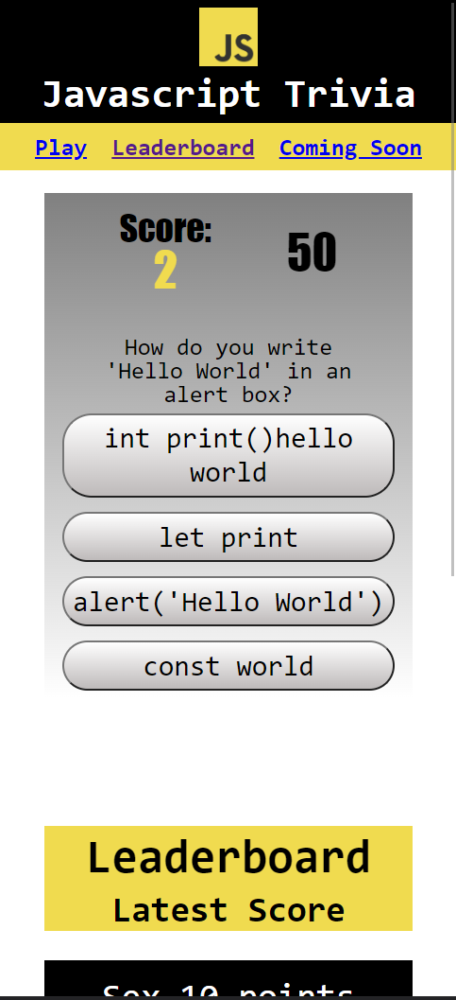

Project Title: Javascript Trivia.

Description: Website with a Javascript themed trivia, and leaderboards for high scores. The website is responsive to the device's screen size, and the trivia will print random questions and answer sets when the play button is pressed.

How to Use: There is no installation required. You can access the project using the provided link. Press play now to start the game. Select the right answer to score points. If the wrong answer is selected, a point will be subtracted, and 3 seconds will be taken away from the timer. the game is over when all questions are answered, or until the timer runs out.

-https://piersalloum.github.io/Javascript-Trivia/

References:
-https://www.w3schools.com/
-https://simplestepscode.com/javascript-quiz-tutorial/
-https://www.geeksforgeeks.org/how-to-create-a-simple-javascript-quiz/
-https://www.codingninjas.com/codestudio/library/how-to-create-a-javascript-quiz-code
-https://www.w3schools.com/jsref/met_win_setinterval.asp

Screenshot of the website:

License:

MIT License

Copyright (c) [2023] [PierSalloum]

Permission is hereby granted, free of charge, to any person obtaining a copy of this software and associated documentation files (the "Software"), to deal in the Software without restriction, including without limitation the rights to use, copy, modify, merge, publish, distribute, sublicense, and/or sell copies of the Software, and to permit persons to whom the Software is furnished to do so, subject to the following conditions:

The above copyright notice and this permission notice shall be included in all copies or substantial portions of the Software.

THE SOFTWARE IS PROVIDED "AS IS", WITHOUT WARRANTY OF ANY KIND, EXPRESS OR IMPLIED, INCLUDING BUT NOT LIMITED TO THE WARRANTIES OF MERCHANTABILITY, FITNESS FOR A PARTICULAR PURPOSE AND NONINFRINGEMENT. IN NO EVENT SHALL THE AUTHORS OR COPYRIGHT HOLDERS BE LIABLE FOR ANY CLAIM, DAMAGES OR OTHER LIABILITY, WHETHER IN AN ACTION OF CONTRACT, TORT OR OTHERWISE, ARISING FROM, OUT OF OR IN CONNECTION WITH THE SOFTWARE OR THE USE OR OTHER DEALINGS IN THE SOFTWARE.